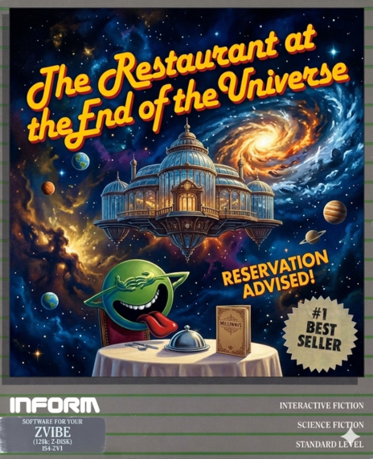

# Restaurant as a ZVibe Test Engine

Restaurant is a Z-machine version 3 story built to be both a playable
interactive fiction game and a high-value regression target for ZVibe. It is
used as the default bundled story because it exercises interpreter behavior
that small opcode conformance tests do not cover well: sustained play, parser
ambiguity, object-tree changes, timed events, save/restore, and long-form text
output.



## Background

Restaurant was built as a purpose-made test vehicle for ZVibe: a real, playable
fan game rich enough to stress the interpreter, with complete source visibility
for verification. It is also a devoted fan-made sequel to the original Infocom
_Hitchhiker's Guide to the Galaxy_ (1984), set in Douglas Adams' five-book
"trilogy", whose absurdist rules, improbable objects, and deadpan non-sequiturs
map naturally to parser-game logic and drive a wide variety of Z-machine
operations. The game draws on the original Infocom ZIL source for the
unreleased sequel, written primarily by Stu Galley.

ZVibe targets embedded systems where RAM, storage, and I/O behavior matter as
much as opcode correctness. A compact conformance suite can verify individual
instructions but cannot represent how a real game stresses the interpreter
across hundreds of turns. Restaurant fills that gap. It is intentionally small
enough for Z-machine v3 hardware constraints while large enough to surface bugs
in memory layout, command parsing, and platform I/O. It runs unchanged on
desktop, microcontroller, FPGA, and targets that execute story files from flash
or generated C arrays, and it exercises save/restore paths across EEPROM, flash,
and host-file backends.

The game has its own repository with full Inform 6 source, cover art, a
complete walkthrough, and development history. This document covers Restaurant
as a ZVibe regression target.

## What It Stresses

Restaurant is especially useful because it combines several independent sources
of interpreter pressure in one scripted playthrough:

| Area | Coverage Value |
|------|----------------|
| Dictionary and parser | Synonyms, invalid commands, topic lookup, command separators, and noun resolution |
| Object table | Moving objects, containers, inventory, scenery, and scope traversal |
| Dynamic memory | Score, flags, object locations, randomized puzzle state, and transient buffers |
| Stack and calls | Normal game routines plus explicit coverage hooks for uncommon opcodes |
| Text output | Long room descriptions, multi-paragraph responses, status updates, and character output |
| Randomness | Random puzzle values and turn-based behavior without requiring a fixed seed |
| Save/restore | State capture across object movement, score changes, globals, and active game state |
| Embedded I/O | Scripted input, output matching, status-line behavior, and UART-friendly pacing |

## Opcode Coverage

Several Z-machine opcodes that conformance suites rarely exercise in context are
covered by specific game mechanics:

| Opcode | What exercises it |
|--------|-------------------|
| `@random` | Parking bay puzzle calls it four times: three for bay number generation, one for the `GenerateTargetBay()` distribution |
| `@save` / `@restore` | Regression script validates a full round-trip: object locations, score, globals, and active game state survive |
| `@sread` | Four distinct call sites: normal input, the `ScoreSub` press-to-continue pause, and two interactive listening steps in the Improbability Void |
| `@storeb` / `@loadb` / `@print_char` | Panel code uses a hand-rolled display buffer built on these three opcodes directly |
| `@show_status` | Status line validated throughout against current score and room name |
| `@verify` | Story file checksum called at startup |
| `@mod`, `@mul`, `@loadw` | Arithmetic and word-read paths exercised in puzzle state calculations |
| `@not`, `@push`, `@pop`, `@nop` | Explicit coverage hooks present in the game source |

The game was designed with this in mind. Coverage was intentional, not
incidental: `ZMACHINE_COVERAGE.md` in the game source maps each opcode to its
call sites and the in-game scenarios that exercise it.

## Why It Complements Czech

The Czech test suite is the right tool for opcode-level conformance. Restaurant
is the right tool for integrated behavior. ZVibe uses both because they answer
different questions:

| Test | Primary Question |
|------|------------------|
| Czech | Does each Z-machine operation behave correctly in isolation? |
| Restaurant | Does the interpreter remain correct while running a real game from start to finish? |

This distinction matters on embedded targets. Bugs in split memory, flash reads,
status updates, line input, save slots, or UART transport may not appear in a
short conformance run, but they often show up during a longer scripted story.

## Regression Scripts

Restaurant has two main scripted uses in ZVibe:

| Script | Purpose |
|--------|---------|
| `games/scripts/restaurant-script.txt` | Complete game walkthrough used for end-to-end regression |
| `games/scripts/restaurant-stress-test.txt` | Extra command coverage for parser, object, and edge-case behavior |

The walkthrough supports captured values, so randomized puzzle output can be
read from the game and reused later in the script. This keeps the test realistic
without forcing the interpreter to use a deterministic random seed.

## Running It

From the repository root:

```bash
cd target/console/tests
make test-restaurant
```

For an interactive desktop run:

```bash
cd target/console
make
./build/bin/zvibe_console ../../games/catalog/restaurant.z3
```

See [Testing](TESTING.md) for the complete regression flow.
